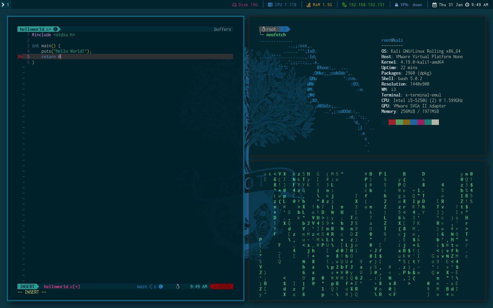
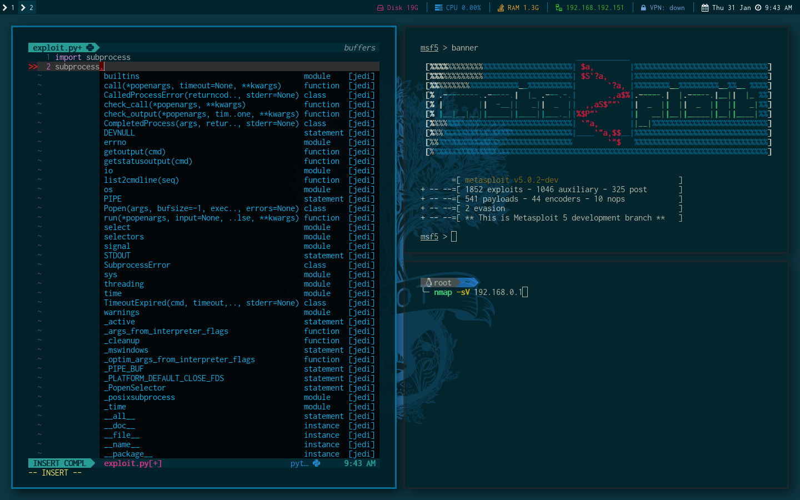
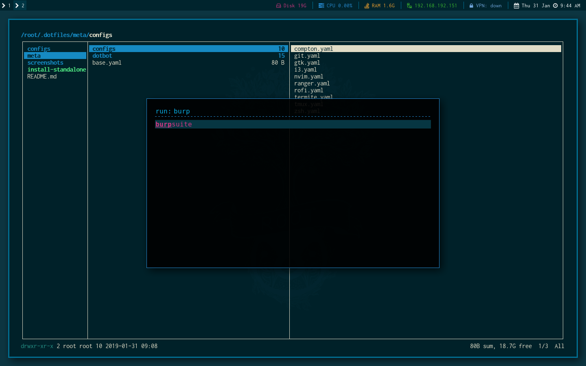

# Kali Linux
Dotfiles for Kali Linux using the i3 window manager.

Deployed using [dotbot](https://github.com/anishathalye/dotbot).
Use the `install-standalone` command.

```bash
# Example (Creates a soft link from dotfiles repository to ~/.config/i3)
./install-standalone i3
```

Options include:
- compton
- git
- gtk
- i3
- nvim
- ranger
- rofi
- termite
- tmux
- zsh

## Notice
As I was too lazy to make the soft linking dynamic, it is important that this repo is in called `.dotfiles` and placed in the home folder.
You can do this by doing `git clone https://github.com/PlatyPew/dotfiles-kali ~/.dotfiles`

## Screenshots





