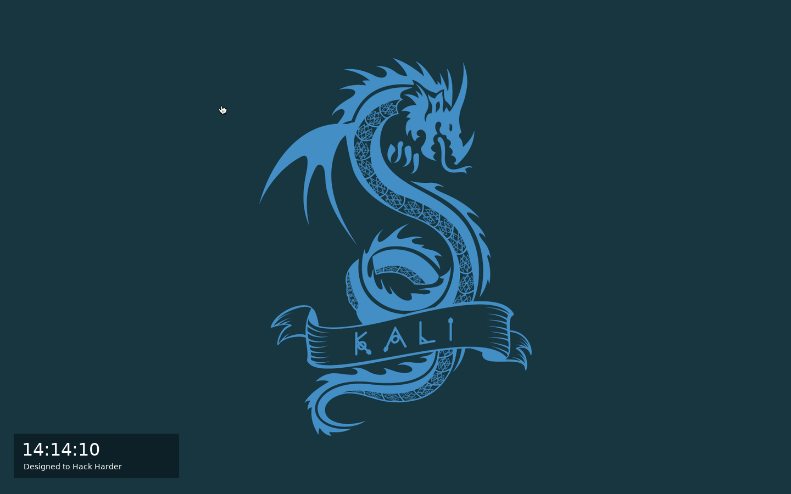
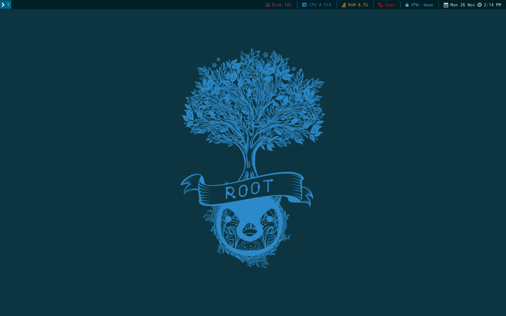
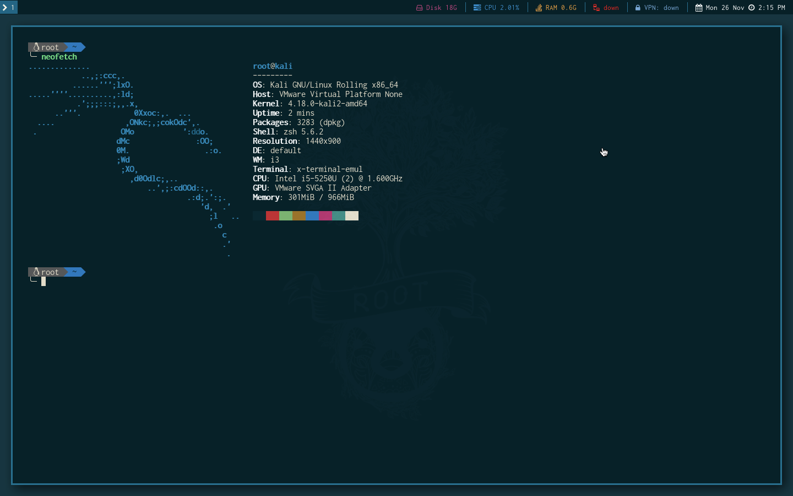
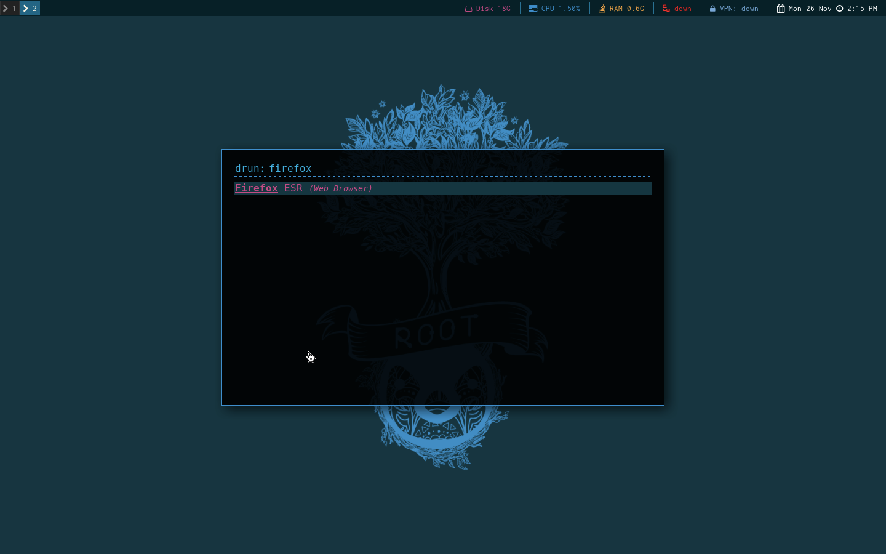
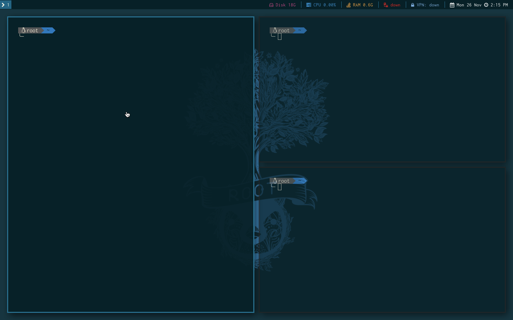
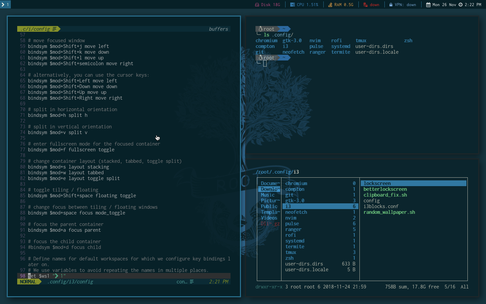

# Kali Linux
Uses i3 window manager

All files are to be placed in `~/.config`

For `tmux/tmux.conf`, `zsh/zshrc` and `git/gitignore`, copy or create a soft link to `~`

Set i3 as default window manager, and allow autologin on Kali.

Set termite as default terminal

## i3
Uses i3-gaps

Mod is `alt`/`option` key

## Screenshots

